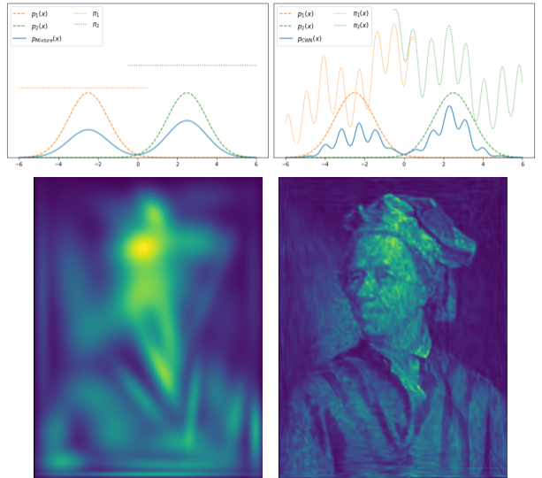

This Github Project is associated to the paper "Classifier Weighted Mixture models"; and provides with reusable code which implements the proposed methods. 


**Summary of the paper:**
---
This paper proposes an extension of standard mixture distributions by replacing the constant mixture weights with a classifying function. Classifier Weighted Mixtures offer straightforward density evaluation, explicit sampling, and enhanced flexibility in variational estimation problems, without increasing the number of components or the complexity of the mixture components.



**How to use the code in practice:**
---
First install the package with using the shell command: 
```shell 
pip install git+https://github.com/ElouanARGOUARCH/Classifier-Weighted-Mixtures
```
and import the corresponding package in python 
```python
import models
```
The CWM model is built from three elements: (i) a base distribution, by default a standard Normal, (ii) a classifying function, by default a Softmax-fully connected neural network and (iii) invertible mappings, by default location-scale (~ diagonal covariance) transformations. 
```python
dim = 1 #dimension of the distribution
K = 10 #number of mixtures components
hidden_dims = [128] #hidden dimensions of the classifying neural network weight function
model = ClassifierWeightedMixture(dim, K, hidden_dims)
samples = torch.randn(1000, 1)
model.train(epochs = 10, batch_size = 100, verbose = True)

model_samples = model.sample([1000]) #sampling 

test_samples = torch.randn(1000, 1)
test_log_prob = model.log_prob(test_samples)
```
Once a CWM is instanciated, it can be trained for density estimation on a set of samples. 

```python
samples = torch.randn(1000, 1)
model.EM_pretraining(samples, epochs = 10)
model.train(samples, epochs = 10, batch_size = 100, verbose = True)#training
```

We can sample from the easily. 

```python
model_samples = model.sample([1000]) #sampling
```

We can also evaluate the PDF. 

```python
test_samples = torch.randn(1000, 1)
test_log_prob = model.log_prob(test_samples) #pdf evaluation
```

**Going further**
--

To clone the project and access more elaborate usage examples: 
```shell
git clone https://github.com/ElouanARGOUARCH/Classifier-Weighted-Mixtures
cd Classifier-Weighted-Mixtures
pip install -r requirements.txt
```


